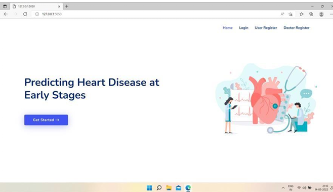
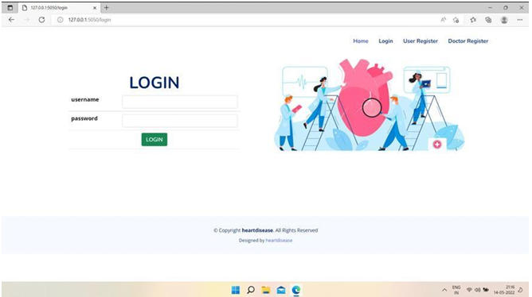
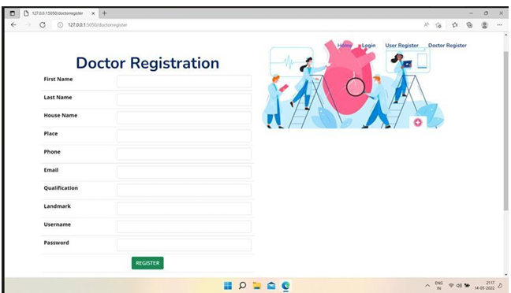

# Predicting Heart Disease at Early Stages

A machine learning-based academic project aimed at predicting heart disease in its early stages, helping individuals take preventive action before the condition becomes critical.

---

## Abstract

Predicting and detecting heart disease has always been a critical and challenging task for healthcare practitioners. Hospitals and clinics often offer expensive treatments and surgeries, making early prediction an essential need for people globally. Heart disease is increasingly common due to lifestyle factors such as alcohol, tobacco usage, and lack of exercise.

This project leverages supervised machine learning algorithms to predict the likelihood of heart disease based on medical and lifestyle data. The models used include Artificial Neural Networks (ANN), Decision Trees (DT), Random Forests (RF), Support Vector Machines (SVM), Naïve Bayes (NB), and K-Nearest Neighbors (KNN). Their performance metrics are analyzed and compared.

---

## 💻 Technology Stack

- **Frontend**: Python
- **Backend**: MySQL
- **Software Tools**: Sublime Text, WAMP, Android Studio
- **Web Server**: Apache
- **Browsers Supported**: Internet Explorer, Google Chrome, Firefox
- **Platform**: Windows 8 or above
---
## 🧩 Modules

### 👨‍💼 Admin
- View registered users
- View doctors and accept/reject their applications
- View and respond to user complaints
- View top-rated doctors

### 👤 User
- Register and log in
- View doctors and book appointments
- Chat with doctors
- Make heart disease predictions
- View booking history
- Send complaints to admin
- Rate and review doctors
- Make payments to doctors

### 👨‍⚕️ Doctor
- Register and log in
- Manage/update consultation fees
- Manage consulting schedule
- View and respond to user chats
- View bookings, chats, and received ratings

---

## 🔐 System Features

-Role-based access (Admin, User, Doctor)
- Secure login and data handling
- Machine Learning–based heart disease prediction
- Online appointment booking
- Payment and rating functionality
- Admin control panel for management

---

## 📸 Screenshots

---

## 🧪 Testing

The project was tested on various parameters:
-Unit Testing (individual modules)
-Integration Testing (workflow between modules)
-Validation Testing (form fields and data inputs)
-Output Testing (report formats and predictions)
-User Acceptance Testing (real-user simulation)
-Performance Testing (runtime and load)

---

## 🎯 Future Enhancements

Integration with wearable health tracking devices
-Real-time ECG and pulse rate analysis
-Mobile app deployment
-AI chatbot for symptom-based triage
-Multi-language support

---

## 🧑‍🎓 Authors
Ansly Roy (Reg No: 190021093041)

Guided by: Mrs. Chinju Kuriachan
Nirmala Arts & Science College, Mulanthuruthy
(Affiliated to Mahatma Gandhi University, Kottayam)

---

## 📘 Academic Context
This project was developed in partial fulfillment of the requirements for the degree of Bachelor of Computer Applications (BCA), 2021-22.

--

## 📝 License
This project is intended for academic and educational use only.

